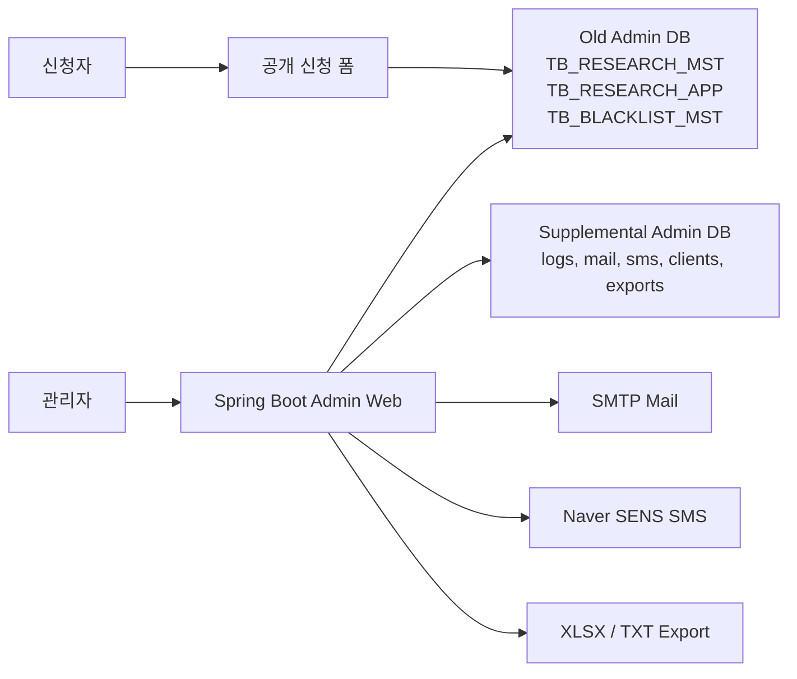

 # Researchi Admin

Researchi Admin은 리서치/좌담회 운영 업무를 통합 관리하기 위해 개발한 **Spring Boot 기반 관리자 백오피스 시스템**입니다.

기존 운영 DB를 전면 교체하지 않고, 약 **400만 건 규모의 레거시 데이터를 유지**하면서 공고 관리, 신청자 관리, 고객사 제공 처리, 블랙리스트, 메일/SMS 발송, 엑셀/TXT 내보내기, 운영 로그를 하나의 관리자 화면에서 처리할 수 있도록 설계했습니다.

---

## 프로젝트 목적

기존 리서치 운영 과정에서는 공고 등록, 신청자 확인, 고객사 전달, 블랙리스트 관리, 메일/SMS 발송, 로그 확인이 분산되어 있거나 수작업에 의존하는 부분이 많았습니다.

이 프로젝트의 목표는 단순한 CRUD 관리자 페이지가 아니라, 실제 운영 중인 레거시 DB를 기준으로 업무 흐름을 안정적으로 통합하는 것입니다.

핵심 목표는 다음과 같습니다.

- 기존 운영 DB를 유지하면서 관리자 기능 확장
- 약 400만 건 규모의 운영 데이터 조회, 검색, 내보내기 지원
- 리서치 공고별 신청자 관리 및 고객사 제공 처리 자동화
- 개인정보가 포함된 운영 업무의 로그 기반 추적성 확보
- 메일/SMS 발송 실수 방지를 위한 simulation mode 지원
- 배포 환경에서 DB 접속 정보, SMTP/SMS Key 등 민감 정보 분리

---

## 주요 기능

| 구분 | 기능 |
| --- | --- |
| 인증/보안 | 관리자 로그인, 로그아웃, 비밀번호 변경, 세션 관리, CSRF 보호 |
| 리서치 관리 | 공고 목록/상세/등록/수정, 홈페이지 게시용 복사 문구 생성 |
| 공개 신청 폼 | `/research/{researchNo}/apply` 기반 신청 페이지 제공 |
| 신청자 관리 | 신청자 목록/상세, 중복 신청 방지, 고객사 제공 여부 관리 |
| 블랙리스트 | 기존 블랙리스트 조회, 등록, 수정, 상태 변경 |
| 메일 | 수동 발송, 예약 발송, 임계치 기반 발송, 발송 로그 |
| SMS | 키워드 매칭 결과 기반 SMS 알림, Naver SENS 연동, 발송 로그 |
| 내보내기 | 신청자 XLSX/TXT 내보내기, 제공 대상 내보내기 |
| 대시보드 | 월별 메일/SMS 사용량 및 예상 비용 확인 |
| 로그 | 관리자 액션, 검색, 메일, SMS, export 로그 관리 |

---

## 기술 스택

| 영역 | 기술 |
| --- | --- |
| Backend | Java 17, Spring Boot, Spring Security |
| View | Thymeleaf, Bootstrap |
| Persistence | MyBatis |
| Database | MySQL 8.x, MariaDB Compatible |
| Export | Apache POI |
| Mail/SMS | Spring Mail, SMTP, Naver Cloud SENS |
| Build/Test | Gradle, JUnit 5, Spring Boot Test |

---

## 아키텍처 방향

이 프로젝트는 **old-admin-DB-first** 구조로 설계했습니다.

기존 운영 DB의 핵심 테이블을 source of truth로 유지합니다.

- `TB_RESEARCH_MST`: 리서치/좌담회 공고 마스터
- `TB_RESEARCH_APP`: 신청자 데이터
- `TB_BLACKLIST_MST`: 블랙리스트 데이터

신규 관리자 기능에 필요한 데이터는 보조 admin 테이블로 분리했습니다.

- 관리자 계정과 액션 로그
- 고객사/담당자 관리
- 메일 템플릿, 발송 작업, 발송 대상
- SMS 알림 로그
- 검색/export 로그
- 매칭 결과와 이력
- 레거시 테이블 수정 전 revision backup

---

## 주요 설계 의도

### 세션 기반 인증을 선택한 이유

이 서비스는 외부 공개 API 중심의 서비스가 아니라 관리자 전용 서버 렌더링 백오피스입니다. 따라서 JWT보다 Spring Security의 세션 기반 인증이 더 적합하다고 판단했습니다.

세션 고정 보호, CSRF 보호, BCrypt 비밀번호 해싱, 로그인 성공/실패 로그를 통해 관리자 화면에 필요한 보안 흐름을 구성했습니다.

### MyBatis를 선택한 이유

기존 운영 DB는 이미 테이블명, 컬럼명, 키 구조가 정해져 있었습니다. JPA로 도메인 모델을 새로 맞추기보다, SQL을 명확하게 제어할 수 있는 MyBatis를 사용해 레거시 테이블과 안정적으로 연결했습니다.

### `RESEARCH_NO` 중심 설계

리서치 공고, 신청자, 메일, SMS, export, 고객사 연결 흐름의 기준을 `RESEARCH_NO`로 통일했습니다. 이를 통해 기존 `document_srl` 중심 흐름과 신규 관리자 흐름이 섞이지 않도록 정리했습니다.

### 대용량 데이터 성능 고려

약 400만 건 규모의 운영 데이터를 다루기 때문에 전체 데이터를 한 번에 조회하지 않고, 목록/상세/검색/내보내기 흐름을 분리했습니다.

목록 조회는 페이지네이션과 조건 기반 검색을 사용하고, 상세 정보는 필요한 시점에 개별 조회하도록 구성했습니다. 내보내기 기능도 리서치 단위와 제공 대상 단위로 분리해 운영자가 필요한 데이터만 처리할 수 있도록 설계했습니다.

### 메일/SMS 발송 안정성

메일과 SMS는 실수로 발송되면 운영 리스크가 큰 기능입니다. 따라서 `simulate-send` 설정을 두어 개발/초기 배포 단계에서 실제 발송을 차단할 수 있도록 했습니다.

SMTP, Naver SENS 설정은 환경 변수와 외부 설정 파일로 분리해 민감 정보가 코드나 JAR에 포함되지 않도록 했습니다.

### 로그 기반 운영 추적

개인정보가 포함된 신청자 데이터와 export 기능은 추적성이 중요합니다. 관리자 액션 로그, 검색 로그, 메일/SMS 로그, export 로그, revision log를 남겨 누가 언제 어떤 데이터를 처리했는지 확인할 수 있도록 했습니다.

---

## AI 툴 활용

프로젝트 진행 과정에서 Codex를 활용해 개발 생산성과 품질 관리 과정을 보조했습니다.

AI를 단순 코드 생성 도구로 사용하지 않고, 다음과 같은 방식으로 활용했습니다.

- PRD, 아키텍처, DB 스키마, API 문서를 기반으로 단계별 구현 범위 정리
- Phase 단위로 기능을 나누어 구현하고, 관련 없는 파일 수정이나 미래 기능 구현을 제한
- 서버 실행 오류, SQL 오류, Thymeleaf 오류, SMTP/SMS 오류 로그 분석
- 수정 후 로컬 테스트와 체크리스트 기반 검증 진행
- GitHub 업로드 전 `.gitignore`, DB dump, local 설정, 개인정보/보안 파일 포함 여부 점검
- AI 제안을 그대로 적용하지 않고 프로젝트 구조와 운영 제약에 맞는지 검토 후 반영

이 과정을 통해 AI를 코드 작성 도구가 아니라 **설계 검토, 오류 분석, 테스트 보조, 문서화, 보안 점검 도구**로 활용했습니다.

---

## 품질 평가와 개선 방향

| 항목 | 현재 품질 | 개선 방향 |
| --- | --- | --- |
| 인증/보안 | 세션, CSRF, BCrypt, 로그인 로그 등 관리자 서비스 기본 보안 반영 | 2FA, 관리자 IP 제한, 권한 등급 분리 추가 가능 |
| DB 연동 | 레거시 DB 구조를 유지하면서 MyBatis로 명시적 SQL 제어 | 주요 검색 조건별 실행 계획과 인덱스 전략 문서화 필요 |
| 대용량 데이터 | 페이지네이션, 조건 검색, 리서치 단위 내보내기로 부하 완화 | 대량 export 시 streaming 방식과 비동기 처리 검토 |
| 메일/SMS | simulation mode와 발송 로그로 운영 리스크 감소 | 실패 재시도, 발송 큐, rate limit 정책 추가 가능 |
| 로그/추적성 | 액션, 검색, 메일, SMS, export, revision log 구성 | 로그 보관 기간과 개인정보 마스킹 정책 강화 가능 |
| 화면 구성 | Thymeleaf와 Bootstrap 기반으로 빠른 관리자 화면 구현 | 공통 fragment와 UI 컴포넌트 정리로 유지보수성 향상 |
| 테스트 | 주요 파서, 렌더러, public form, legacy flow 테스트 일부 구성 | 핵심 서비스와 Mapper 통합 테스트 확대 필요 |

---

## 실행 및 배포 참고

개발 실행과 배포 절차는 아래 문서를 기준으로 관리합니다.

- [개발 실행 가이드](docs/DEV-RUN.md)
- [배포 가이드](docs/DEPLOYMENT.md)
- [아키텍처 문서](docs/ARCHITECTURE.md)
- [DB 스키마 문서](docs/DB-SCHEMA.md)
- [API 스펙](docs/API-SPEC.md)

운영 배포 시 아래 파일과 데이터는 저장소에 포함하지 않습니다.

- `application-local.yml`
- `.env`, `.env.*`
- DB dump 파일
- private key, keystore
- local `uploads/`, `exports/`, `build/`, `.gradle/`

---

## 프로젝트를 통해 배운 점

이 프로젝트를 통해 신규 기능을 빠르게 만드는 것만큼, 이미 운영 중인 데이터 구조와 업무 흐름을 깨지 않는 설계가 중요하다는 점을 배웠습니다.

특히 레거시 DB, 개인정보, 메일/SMS 발송, 대용량 데이터, 배포 설정이 함께 얽힌 백오피스에서는 기능 구현뿐 아니라 성능, 보안, 로그, 운영 절차까지 함께 고려해야 안정적인 시스템이 된다는 것을 경험했습니다.
